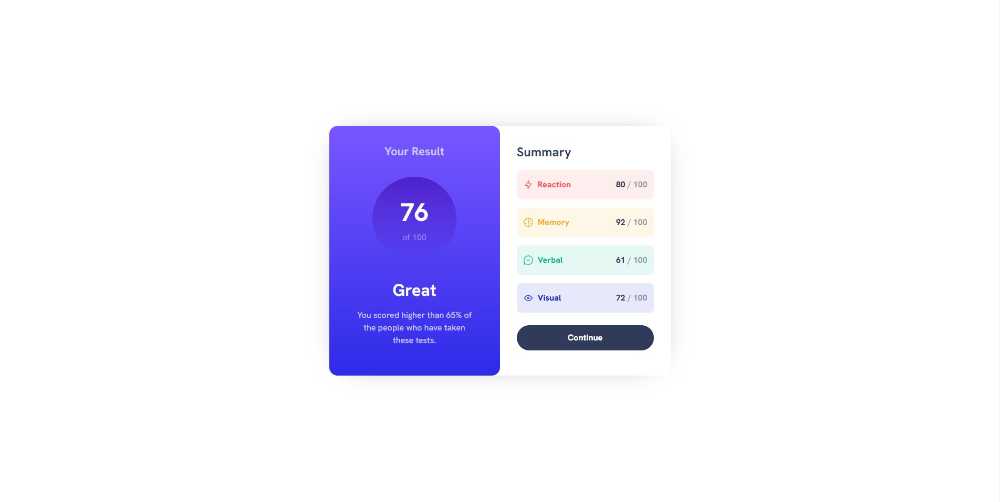

# Frontend Mentor - Results summary component

This is a solution to the [Results summary component challenge on Frontend Mentor](https://www.frontendmentor.io/challenges/results-summary-component-CE_K6s0maV). Frontend Mentor challenges help you improve your coding skills by building realistic projects.

## Table of contents

- [Overview](#overview)
  - [Screenshot](#screenshot)
  - [Links](#links)
  - [Built with](#built-with)
- [Author](#author)

## Overview

Second project of the Frontend Mentor challenges, featuring results summary component with dynamic score values fetched from a JSON file.

### Screenshot

### Links

- Solution URL: [Frontend Mentor](https://www.frontendmentor.io/solutions/results-summary-component-using-sassscss-flexbox-and-js-SnaVVgCpLL)
- Live Site URL: [GitHub Page](https://nastaj.github.io/results-summary-component/)

### Built with

- Semantic HTML5 markup
- SCSS
- CSS custom properties
- Flexbox
- JavaScript

## Author

- Frontend Mentor - [@nastaj](https://www.frontendmentor.io/profile/nastaj)
- Discord - [@aseirel]
